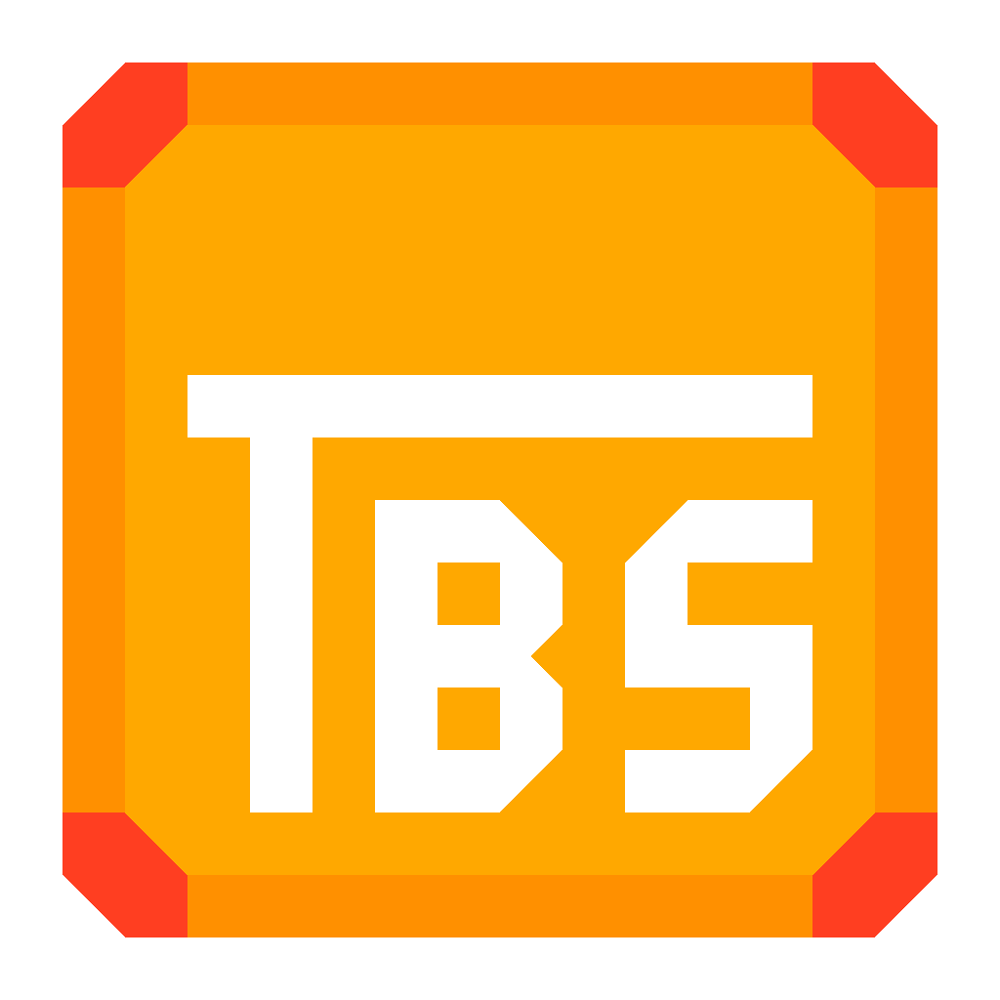

# TableScript

Library that serves as interpreter for TableScript scripting language.

## Usage
Very straightforward: create a Script from source code, and execute it.

## Docs
Check the [documentation](https://siljamdev.github.io/TableScript/index.html)  
There is also a [notepad++ language](./n++)